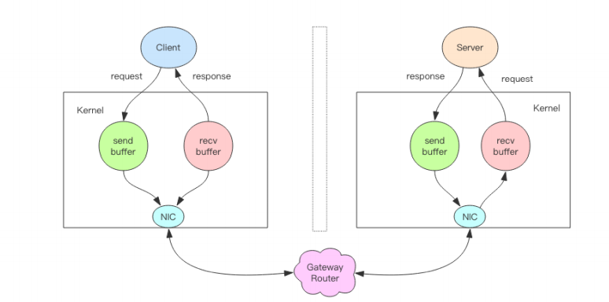
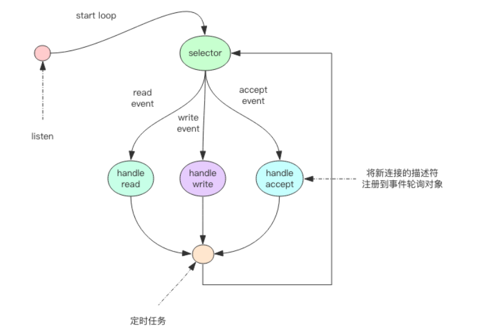
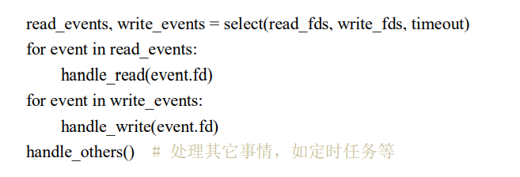

# 原理 ：Redis线程 IO 模型
> 首先,redis是个单线程序(这里特指处理线程)

Redis单线程为什么还这么快?
> 因为它的所有数据都保存在内存之中，所有运算都是内存级别的运算，所以要小心使用复杂度为On的命令，一不小心就会使得redis卡顿

# 非阻塞IO (NIO)

Redis单线程如何处理多客户端的链接?
> 一个完整的流程是这样的
> 

>1.客户端进程调用write方法，将需要发送的内容写入到内核为socket分配的send buffer之中
>2.客户端操作系统内核将send buffer里面的东西，发送到网卡，由网卡发送到服务端
>3.服务端网卡接收到数据，操作系统内核将网卡的内容放到recv buffer里面
>4.服务端调用recv方法将数据读出，进行处理

>但是当我们调用read方法的时候，默认是阻塞的，非阻塞IO在套接字对象上添加了一个参数Non_Blocking，当这个参数打开的时候，读写方法不会阻塞，而是能读多少读多少，能写多少写多少，有了这个之后，线程就可以在读写IO的时候不必再阻塞了。

# 事件轮询
>非阻塞 IO 有个问题，那就是线程要读数据，结果读了一部分就返回了，线程如何知道
何时才应该继续读。也就是当数据到来时，线程如何得到通知。写也是一样，如果缓冲区满
了，写不完，剩下的数据何时才应该继续写，线程也应该得到通知。

>事件轮询APi就是用来解决这个问题的，最简单的API就是select函数，输入是读写的fd列表，read_fds 和 write_fds，输出对应的是这两个列表里面可读写的事件。同时还提供了一个timeout参数，如果没有事件到来，那么最多等待timeout的时间，拿到时间后，线程就可以挨个处理到来的事件，处理完了再进入下一个循环

>通过select系统调用我们可以同时处理多个通道的描述符事件，但是现代操作系统已经不用select了，在linux中，改用epoll

>1.select有最大文件描述符限制 默认1024个
>2.poll去除了这个限制
>3.select 和 poll 都是会把全量的fd拿回来，再依次遍历，而epoll是返回已经就绪的fd

# 定时任务

>redis除了要处理客户端的指令之外，还要有许多其他的定时任务，如果线程阻塞再select中，定时任务将无法准时的被调度
>redis的定时任务会放在一个最小堆中，最快要执行的任务放在最上方，在每个循环周期，redis都会将最小堆里面已经到点的任务进行处理，将马上要执行的任务还需要的时间记录下来，这个时间就是select(epoll)的超时时间