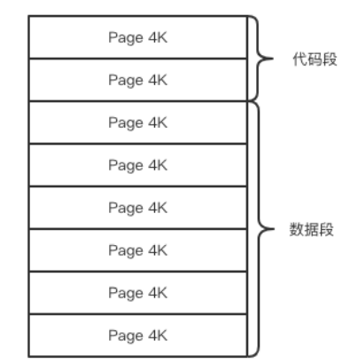
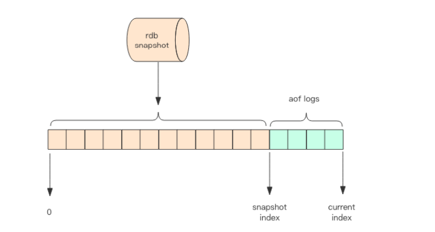

# 持久化
> Redis持久化的方式有两种，AOF和RDB，AOF是日志，RDB是快照，快照是一次的全量备份，AOF日志是连续的增量的备份，快照是Redis内存数据的二进制序列化形式，在存储上非常紧凑，而AOF是记录内存数据修改的文本，AOF文件在长期的运行中会变的庞大，数据库重启的时候要加载AOF对之前的操作进行回放，这个时间就会比较长，所以要定期对AOF进行重写

# 快照原理(RDB)
> 我们知道 redis是单线程，这个线程需要负责多个客户端的并发读写操作和内存数据结构的逻辑读写，在服务线上请求的同时，Redis 还需要进行内存快照，内存快照要求 Redis 必须进行文件 IO 操作，可文件 IO 操作是不能使用多路复用 API。这意味着单线程同时在服务线上的请求还要进行文件 IO 操作，文件 IO 操作会严重拖垮服务器请求的性能。还有个重要的问题是为了不阻塞线上的业务，就需要边持久化边响应客户端请求。持久化的同时，内存数据结构还在改变，比如一个大型的 hash 字典正在持久化，结果一个请求过来把它给删掉了，还没持久化完呢，这尼玛要怎么搞？
那该怎么办呢？

> Redis使用操作系统的COW机制来实现快照的持久化，COW也叫写时复制
## fork
> Redis 在持久化时会调用 glibc 的函数 fork 产生一个子进程，快照持久化完全交给子进程来处理，父进程继续处理客户端请求。子进程刚刚产生时，它和父进程共享内存里面的代码段和数据段。这时你可以将父子进程想像成一个连体婴儿，共享身体。这是 Linux 操作系统的机制，为了节约内存资源，所以尽可能让它们共享起来。在进程分离的一瞬间，内存的增长几乎没有明显变化。

> 子进程做持久化，不会对内存中的数据有任何的更改，但是父进程就不一样了，它需要处理很多的写请求，会对内存中的数据不断的进行修改
> COW的原理是，当2个进程的虚拟内存映射到物理内存同一个页面的时候，两者会共用这一页内存，但是当有一方修改内存的数据的时候，就会先copy当前页面，然后再修改复制出来的那一页，这时子进程相应的页面是没有变化的，还是进程产生时那一瞬间的数据

> 随着父进程修改操作的持续进行，越来越多的共享页面被分离出来，内存就会持续增长。但是也不会超过原有数据内存的 2 倍大小。另外一个 Redis 实例里冷数据占的比例往往是比较高的，所以很少会出现所有的页面都会被分离，被分离的往往只有其中一部分页面。每个页面的大小只有 4K，一个 Redis 实例里面一般都会有成千上万的页面。子进程因为数据没有变化，它能看到的内存里的数据在进程产生的一瞬间就凝固了，再也不会改变，这也是为什么 Redis 的持久化叫「快照」的原因。接下来子进程就可以非常安心的遍历数据了进行序列化写磁盘了。

# AOF原理
> AOF 日志存储的是 Redis 服务器的顺序指令序列，AOF 日志只记录对内存进行修改的指令记录。假设 AOF 日志记录了自 Redis 实例创建以来所有的修改性指令序列，那么就可以通过对一个空的 Redis 实例顺序执行所有的指令，也就是「重放」，来恢复 Redis 当前实例的内存数据结构的状态。Redis 会在收到客户端修改指令后，先进行参数校验，如果没问题，就立即将该指令文本存储到 AOF 日志中，也就是先存到磁盘，然后再执行指令。这样即使遇到突发宕机，已经存储到 AOF 日志的指令进行重放一下就可以恢复到宕机前的状态。Redis 在长期运行的过程中，AOF 的日志会越变越长。如果实例宕机重启，重放整个AOF 日志会非常耗时，导致长时间 Redis 无法对外提供服务。所以需要对 AOF 日志瘦身。

## AOF瘦身

>Redis 提供了 bgrewriteaof 指令用于对 AOF 日志进行瘦身。其原理就是开辟一个子进程对内存进行遍历转换成一系列 Redis 的操作指令，序列化到一个新的 AOF 日志文件中。序列化完毕后再将操作期间发生的增量 AOF 日志追加到这个新的 AOF 日志文件中，追加完毕后就立即替代旧的 AOF 日志文件了，瘦身工作就完成了。

## fsync
> AOF文件是以日志的形式存在的，当程序对AOF日志文件进行写操作的时候，实际上是将内容写到了内核为该日志文件分配的文件描述符中，然后内核会异步的将数据刷回磁盘中(mmap)
> 这就意味着，如果突然宕机，数据还没来的及及时刷回磁盘，数据就会丢失
> Linux 的 glibc 提供了 fsync(int fd)函数可以将指定文件的内容强制从内核缓存刷到磁盘。只要 Redis 进程实时调用 fsync 函数就可以保证 aof 日志不丢失。但是 fsync 是一个磁盘 IO 操作，它很慢！
> Redis 同样也提供了另外两种策略，一个是永不 fsync——让操作系统来决定合适同步磁盘，很不安全，另一个是来一个指令就 fsync 一次——非常慢。一般采用一秒sync一次

## 4.0 混合持久化

> 重启 Redis 时，我们很少使用 rdb 来恢复内存状态，因为会丢失大量数据。我们通常使用 AOF 日志重放，但是重放 AOF 日志性能相对 rdb 来说要慢很多，这样在 Redis 实例很大的情况下，启动需要花费很长的时间。Redis 4.0 为了解决这个问题，带来了一个新的持久化选项——混合持久化。将 rdb 文件的内容和增量的 AOF 日志文件存在一起。这里的 AOF 日志不再是全量的日志，而是自持久化开始到持久化结束的这段时间发生的增量 AOF 日志，通常这部分 AOF 日志很小。

> 于是在 Redis 重启的时候，可以先加载 rdb 的内容，然后再重放增量 AOF 日志就可以完全替代之前的 AOF 全量文件重放，重启效率因此大幅得到提升。
